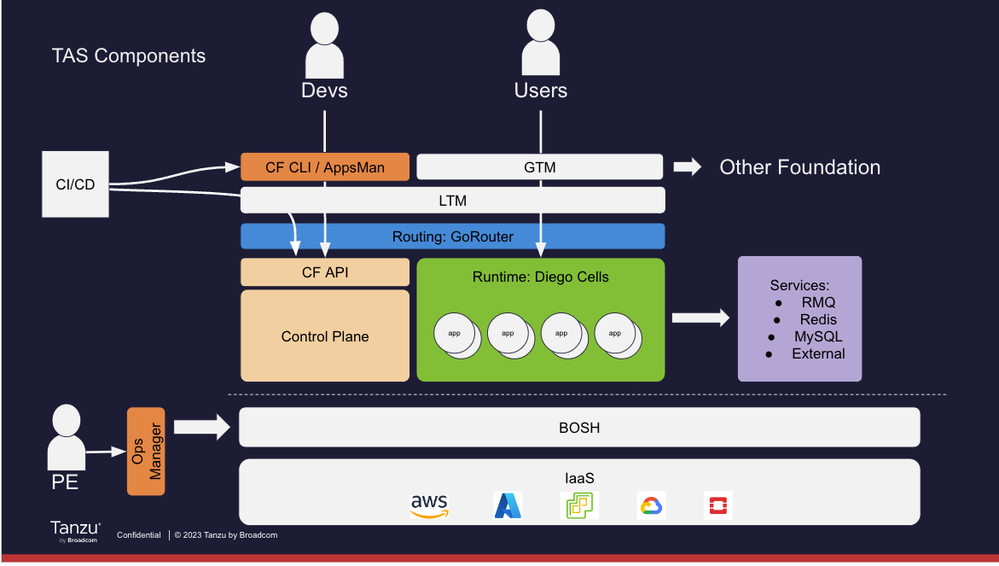

# Overview

This should be the start of day 2.  At this point you should review what was done yesterday and fold in the architecture diagram slide to describe a little bit more about what each section of the architecture does:

* Control Plane (API, Blobstore, BBS/Scheduling)
* Routing (GoRouter) + Network Load balancers
* Runtime (Diego)
* Services

Might be a good time to briefly discuss what Platform Ops does and what Opsman and BOSH are.  These are devs, so don't go too deep.  Just want to summarize.

Yesterday was all about Deploying Code, today will be mostly about operating your app once it has been deployed.  However, first we would like to take everything we learned yesterday, and talk about how it's actually done in the real world with CI/CD and Pipelines...