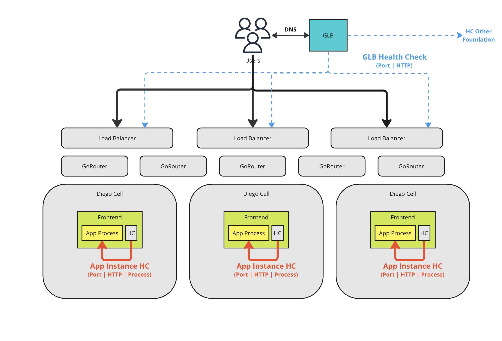

# Overview
Application health checks are one of the most important aspects of application Operations in TAS.  It will be important for the appops folks to understand all of the different levels of healthchecks that apply to a happily running application.

As an operator, it will be important to understand how health checks impact application resliency within a foundation (local resiliency) and across foundations (global resiliency).  

Start the conversation from the bottom up, covering in order:

* **When App Startup fails**: Application Startup Health Checks
* **When an single AI Fails**: Application Readiness and Liveliness Healthchecks
* **When an entire app or foundation fails**: External Health Checks from a GLB

I've found that a whiteboard or MIRO session is helpful to explain how the healthchecks work and what actions they take.  Something like the below diagram

DEMO is needed here

# TAS Application Health Checks

Cover the differences between the following HC options for AI:
* Port - AI crashes if port goes down
* Process - AI Crashes if app process terminates
* HTTP - AI Crashes if app HTTP HC returns non-200 (recommended)

Also cover the difference between Liveliness and Readiness Checks
* Liveliness - If fails, AI will crash and restart
* Readiness - If Fails, AI will be taken out of the routing table, but will not crash