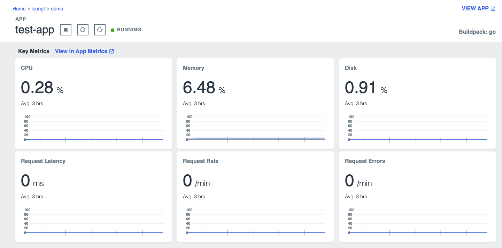
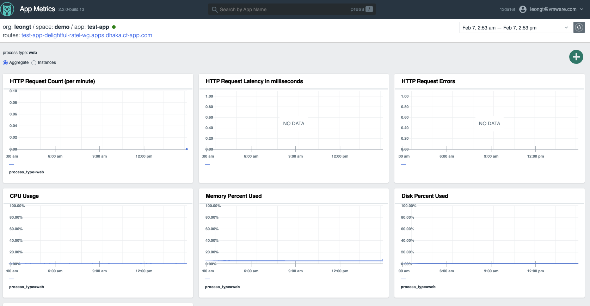

# Overview
App developers have several options for telemetry on TAS from basic point-in-time compute statistics all the way up to deep, holistic, multi-foundation APM metrics.

You can structure this module to build up monitoring capabilities from basic to complex.

* Out of the box metrics shown in CF CLI and apps manager
* App Metrics add-on that pulls in application centric metrics like response time and errors.

* Integrated APM metrics provided by 3rd party providers like AppDynamics or DynaTrace
* AOA integrated with TAS to provide deep OTEL-based application metrics that can span multiple foundations and clouds

Structure demo here based on what capabilities they currently have along with "Art of the Possible" with AOA.

